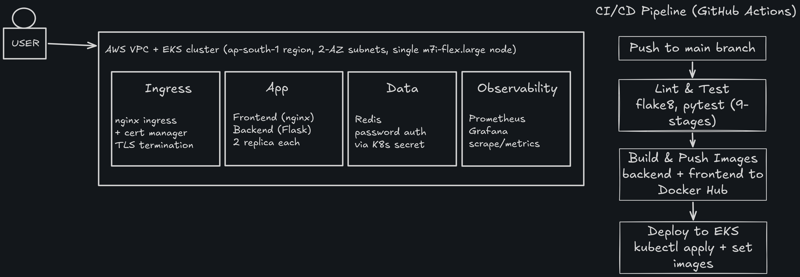

# URL Shortener

A full-stack URL shortener built to demonstrate a complete, production-style DevOps workflow: containerization → CI/CD → Kubernetes deployment → observability → TLS.

## Diagram



## Architecture

- **Frontend:** Static HTML/JS served via Nginx
- **Backend:** Python Flask REST API (Gunicorn in production), instrumented with Prometheus metrics
- **Database:** Redis (key-value store for short code → URL mapping), password-protected
- **Infrastructure:** Terraform-provisioned AWS VPC + EKS cluster, remote state in S3
- **Ingress:** nginx-ingress controller behind an AWS Network Load Balancer, TLS termination via cert-manager
- **CI/CD:** GitHub Actions — lint, test, build, push (Docker Hub), deploy (EKS) on every push to `main`
- **Observability:** Prometheus scraping real application metrics, Grafana for visualization

## API Endpoints

| Method | Endpoint         | Description                                  |
|--------|------------------|-----------------------------------------------|
| POST   | `/shorten`       | Body: `{"url": "..."}` → returns short code   |
| GET    | `/<code>`        | Redirects to the original long URL            |
| GET    | `/stats/<code>`  | Returns metadata for a short code             |
| GET    | `/health`        | Health check (used by K8s probes)             |
| GET    | `/metrics`       | Prometheus metrics endpoint                   |

## Running Locally

Requires Docker and Docker Compose.

```bash
docker-compose up --build
```

- Frontend: http://localhost:8080
- Backend API: http://localhost:5000
- Redis: localhost:6379

## Running Without Docker (backend only)

```bash
cd backend
python -m venv venv
source venv/bin/activate   # Windows: venv\Scripts\activate
pip install -r requirements.txt
# Run Redis separately, e.g.:
# docker run -p 6379:6379 redis:7-alpine
python app.py
```

## Running Tests

```bash
cd backend
pip install -r requirements.txt
pytest tests -v
```

Tests mock Redis, so no live database connection is required.

## Deploying to AWS (EKS)

Requires: AWS CLI configured, Terraform >= 1.6.0, kubectl.

One-time setup — create the S3 bucket for Terraform remote state:
```bash
./scripts/bootstrap-tfstate.sh
```

Bring the entire stack up (infra → ingress → cert-manager → secrets → app → observability):
```bash
make up
```

Tear everything down (releases the load balancer first, then destroys all infra):
```bash
make down
```

Check status of a running deployment:
```bash
make status
```

`make up` provisions a VPC + EKS cluster via Terraform, installs the nginx ingress controller and cert-manager, creates the Redis and Grafana secrets interactively, applies all Kubernetes manifests, and prints the load balancer address for testing:

```bash
curl -k -H "Host: url-shortener.local" https://<load-balancer-address>/health
```

**Note:** TLS currently uses a self-signed certificate issued by cert-manager (no real domain is configured), so `curl -k` / browser security warnings are expected. See `k8s/tls/cluster-issuer.yaml`.

## CI/CD

Every push to `main` triggers `.github/workflows/ci-cd.yml`:
1. Lint (flake8) and test (pytest) the backend
2. Build backend and frontend Docker images
3. Push both images to Docker Hub (tagged `backend-latest`/`frontend-latest` and by commit SHA)
4. Apply Kubernetes manifests and roll out the new images to EKS

## Infrastructure

Terraform (`terraform/`) provisions:
- A 2-AZ VPC with public/private subnets and a NAT gateway
- An EKS cluster (IAM roles for cluster and node group; IRSA/OIDC not yet configured)
- A managed node group (currently `m7i-flex.large`, single node)

State is stored remotely in S3 with native locking (`terraform/versions.tf`).

**Note:** The EKS API endpoint is publicly accessible (`endpoint_public_access = true`, no CIDR restriction). This is intentional to keep the GitHub Actions deploy job working without managing a dynamic IP allowlist — access is still gated by IAM authentication. For a stricter setup, restrict `public_access_cidrs` in `terraform/eks.tf` and run deployments from a fixed egress IP (e.g. a self-hosted runner or VPN).

## Observability

Prometheus scrapes the backend's `/metrics` endpoint (via `prometheus-flask-exporter`) every 15 seconds. Grafana is pre-configured with Prometheus as a data source.

```bash
kubectl port-forward svc/grafana-service 3000:80
# open http://localhost:3000 (login: admin / password set in scripts/create-secrets.sh)
```

## Secrets

Redis and Grafana credentials are managed via Kubernetes Secrets, created interactively (never committed to git):

```bash
./scripts/create-secrets.sh
```

## Cost Note

This deploys real, billable AWS resources (EKS control plane, EC2 node, NAT gateway, Network Load Balancer). Run `make down` when you're done to avoid ongoing charges — none of this is covered by the AWS free tier.

## Project Status

- [x] Containerized frontend, backend, and Redis
- [x] CI/CD pipeline (GitHub Actions) building and pushing images
- [x] Kubernetes manifests for deployment (app, Redis, Ingress)
- [x] Terraform for provisioning cluster infrastructure, with remote S3 state
- [x] Prometheus + Grafana monitoring stack
- [x] Automated tests
- [x] Secrets management (Redis auth, scripted secret creation)
- [x] TLS via cert-manager
- [x] One-command spin-up/spin-down automation (`make up` / `make down`)
